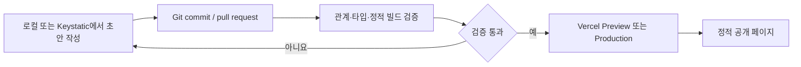

# seongju.vercel.app

[](https://github.com/ghdtjdwn/myBlog/actions/workflows/ci.yml)

프로젝트의 결과만 나열하지 않고 문제, 선택한 대안, 검증 근거와 남은 한계를 함께 기록하는
홍성주의 엔지니어링 기술 블로그입니다.

[한국어 사이트](https://seongju.vercel.app) ·
[English](https://seongju.vercel.app/en/) ·
[GitHub profile](https://github.com/ghdtjdwn)


## 이 저장소가 해결하는 문제

프로젝트 README와 Git 이력은 구현 사실을 증명하기에는 좋지만, 여러 저장소에 걸친 결정과 실패를
처음 보는 사람이 따라가기 어렵습니다. 반대로 프로젝트 요약 글만으로는 주장을 원본 코드와 연결하기
어렵습니다. 이 사이트는 다음 세 층을 한 경로로 연결합니다.

1. 프로젝트 저장소의 코드, 테스트, ADR, 작업 로그와 troubleshooting을 원본 근거로 둡니다.
2. 프로젝트 페이지에서 역할·상태·아키텍처·검증 범위를 요약하고 원본 링크를 제공합니다.
3. 재사용 가능한 판단과 실제 장애를 별도 기술 글로 다시 구성합니다.

비공개 저장소와 개인 기록은 자동 수집하지 않으며, 공개 글은 확인 가능한 기여와 결과만 사용합니다.

## 콘텐츠 구조

| 콘텐츠 | 답하는 질문 | 공개 기준 |
| --- | --- | --- |
| Projects | 무엇을 만들었고 어디까지 맡았는가 | 현재 상태, 역할 경계, 검증과 한계를 함께 표시 |
| Posts | 어떤 문제를 어떻게 풀었는가 | 원본 코드·ADR·실험 링크가 있는 사례만 발행 |
| Decisions | 왜 이 선택을 했는가 | 대안과 재검토 조건이 남아 있는 결정 |
| Incidents | 무엇이 실패했고 어떻게 재발을 막았는가 | 실제 장애·배포·CI 근거가 있는 기록 |

한국어와 영어는 같은 slug의 별도 원문으로 관리합니다. 런타임 자동 번역에 의존하지 않고 각 페이지에
canonical, `hreflang`과 `x-default`를 생성합니다.

## 게시 흐름



새 기록은 항상 draft로 시작합니다. CI는 끊어진 카테고리·프로젝트 관계, 한·영 slug 불일치, 잘못된
내부 링크, draft 노출과 생성 산출물을 검사한 뒤에만 배포를 허용합니다.

## 기술 설계

| 영역 | 구현 |
| --- | --- |
| Application | Astro 7 정적 출력, TypeScript strict, React 기반 관리자 UI |
| Content | Markdown/MDX Content Collections, schema 검증, 한국어·영어 원문 |
| Editing | Keystatic GitHub mode, 코드와 분리된 콘텐츠·메뉴·테마 편집 |
| Delivery | GitHub Actions, Vercel Preview/Production, draft 격리 |
| Web quality | semantic HTML, keyboard navigation, RSS, sitemap, Open Graph, JSON-LD |
| Operations | Web Analytics, Speed Insights, canonical·보안 header 검증 |

Astro를 선택한 이유와 Next.js, S3·CloudFront, k3s, GitHub Pages를 제외한 근거는
[ADR-0001](docs/adr/0001-stack-and-hosting.md)에 기록했습니다. Git 기반 관리자를 선택한 대안 비교는
[ADR-0002](docs/adr/0002-git-based-cms.md), GitHub와 블로그의 역할 분리는
[ADR-0005](docs/adr/0005-github-and-blog-public-surfaces.md)에서 확인할 수 있습니다.

## 로컬 실행과 검증

Node.js 24와 npm을 사용합니다.

```bash
nvm use
npm ci
npm run dev
```

전체 로컬 게이트는 콘텐츠 관계, Astro 검사, production build와 draft 격리를 순서대로 검증합니다.

```bash
npm test
```

개별 명령은 다음과 같습니다.

```bash
npm run check            # Astro와 콘텐츠 타입 검사
npm run verify:content   # 관계와 링크 검사
npm run build            # 정적 production build
npm run verify           # 생성 파일과 draft 격리 검사
```

## 새 기록 만들기

같은 slug의 한국어·영어 초안을 함께 생성합니다. 기존 파일은 덮어쓰지 않습니다.

```bash
npm run new:record -- <project|post|decision|incident> <slug> "제목"
```

<details>
<summary>Keystatic 관리자와 배포 운영 메모</summary>

로컬 개발 서버에서는 `http://127.0.0.1:4321/keystatic`에서 콘텐츠와 사이트 설정을 편집할 수 있습니다.
Production의 `/admin`은 GitHub 인증을 거쳐 저장소 commit으로 변경을 남깁니다. 새 글과 프로젝트는
기본적으로 draft이며 공개 상태를 명시적으로 바꿔야 합니다.

새 배포에서 GitHub App을 설정해야 할 때만 `npm run dev:cms-setup`을 실행합니다. OAuth secret과 검색
소유권 값은 로컬 환경 또는 Vercel 환경 변수에만 두고 저장소에 기록하지 않습니다.

`seongju.vercel.app`은 자동 프로젝트 도메인이 아니라 검증된 Production 배포에 수동으로 연결하는
alias입니다. alias를 바꾸기 전에는 commit, project, target과 Ready 상태를 확인하고 기존 배포 URL을
rollback 값으로 보존합니다.

</details>

## 문서

- [기술 스펙](docs/TECH_SPEC.md)
- [프로젝트 공개 범위 카탈로그](docs/PROJECT_CATALOG.md)
- [엔지니어링 기록 운영 방식](docs/ENGINEERING_RECORDS.md)
- [Architecture Decision Records](docs/adr/)
- [Troubleshooting records](docs/troubleshooting/)
- [실제 작업 로그](WORKLOG.md)

## 범위와 제약

- 저장소의 CI 성공은 Vercel 환경 변수, alias 또는 외부 링크의 실제 동작까지 증명하지 않습니다.
- 비공개 저장소의 코드·문서·URL은 공개하지 않고, 공개 가능한 역할과 검증 범위만 별도로 작성합니다.
- 공개 수치와 상태는 기록 시점의 근거를 함께 남기며 현재의 상시 가용성이나 성능 보장으로 확대하지 않습니다.
